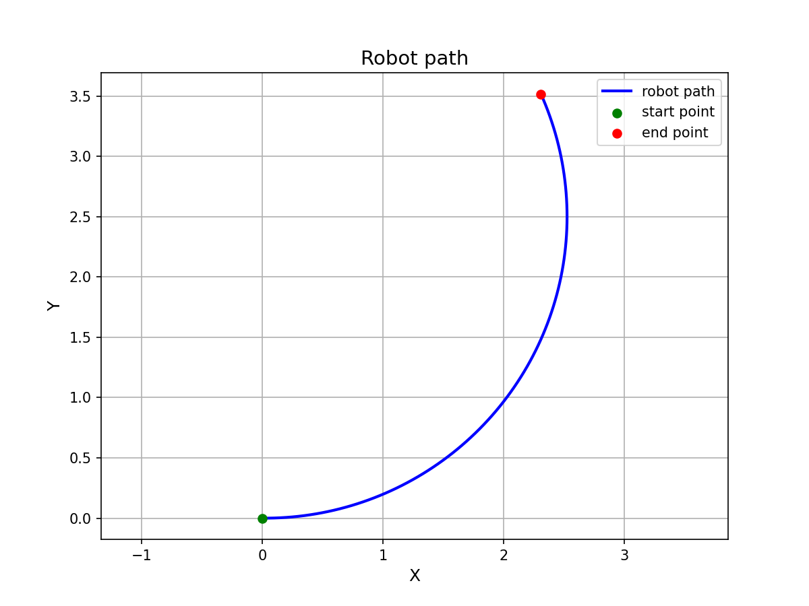

# Robot Motion Simulation

## What is this project?

This project simulates the motion of a robot in a 2D plane.
The robot moves with a given linear velocity and angular velocity, and at
each time step its new position is computed. At the end, the full
trajectory is plotted using `matplotlib` and saved to `output.png`.

## Robot Motion Equations

The robot's state is described by three values: $x$, $y$, and the heading
angle $\theta$. At each time step $dt$, given the linear velocity $v$ and
angular velocity $w$, the new values are computed as follows:

$$x_{new} = x + v \cdot \cos(\theta) \cdot dt$$

$$y_{new} = y + v \cdot \sin(\theta) \cdot dt$$

$$\theta_{new} = \theta + w \cdot dt$$

## How to run

1. Install the requirements:
```bash
pip install matplotlib
```

2. Run the program:

```bash
python differential_motion.py
```

After running, the robot's trajectory is computed and the plot is saved
to `output.png`.

## Default Parameters

| Parameter | Value | Description |
|-----------|-------|-------------|
| `x`, `y`  | `0`   | Initial position |
| `theta`   | `0`   | Initial heading (radians) |
| `v`       | `0.5` | Linear velocity |
| `w`       | `0.2` | Angular velocity |
| `dt`      | `0.1` | Time step |

## Example Output


