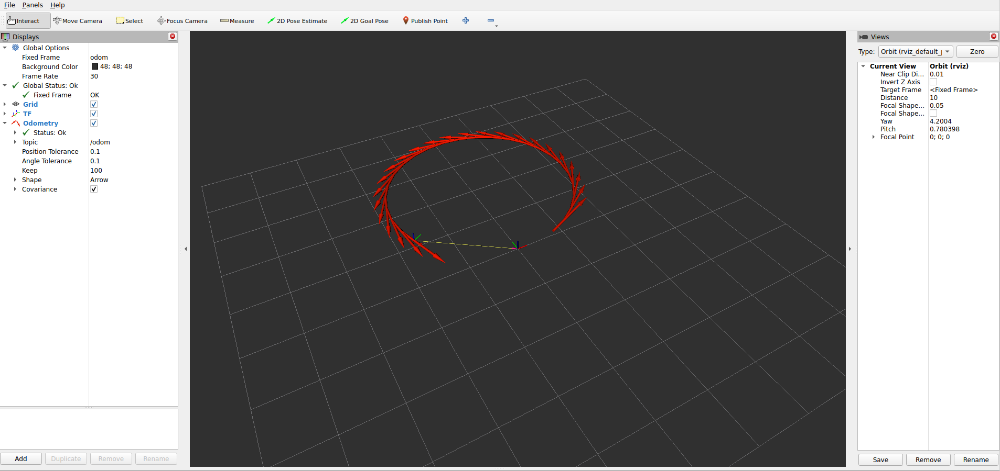

# robot_motion_sim

## Overview

`robot_motion_sim` is a ROS 2 C++ package for simulating planar mobile robot motion.

The simulator subscribes to velocity commands on `/cmd_vel`, updates the robot state in a timer-based loop, and publishes the robot state as pose, odometry, and TF.

The main frame relationship is:
```text
odom -> base_link
```

This project demonstrates:

- ROS 2 publishers and subscribers
- Timer-based simulation
- ROS 2 parameters loaded from YAML
- Launch files for reproducible startup
- Odometry and TF publishing
- Basic RViz visualization for TF and odometry

## Features

- Subscribes to `/cmd_vel`
- Publishes `/robot_pose`
- Publishes `/odom`
- Publishes `/tf`
- Loads parameters from `config/sim_params.yaml`
- Starts the simulator with `ros2 launch`
- Optionally opens RViz with a saved configuration
- Stops the robot when commands become stale

## Build

From the root of the ROS 2 workspace:

```bash
colcon build --packages-select robot_motion_sim
source install/setup.bash
```

## Launch

Run simulator only:

```bash
ros2 launch robot_motion_sim sim.launch.py use_rviz:=false
```

Run simulator with RViz:

```bash
ros2 launch robot_motion_sim sim.launch.py use_rviz:=true
```

The launch file is located at:

```text
launch/sim.launch.py
```

## Configuration

Parameters are stored in:

```text
config/sim_params.yaml
```

Current parameters:

```yaml
robot_simulator_node:
  ros__parameters:
update_rate_hz: 20.0
command_timeout: 0.5
odom_frame_id: "odom"
base_frame_id: "base_link"
```

You can inspect the loaded parameters with:

```bash
ros2 param list /robot_simulator_node
ros2 param get /robot_simulator_node update_rate_hz
ros2 param get /robot_simulator_node odom_frame_id
```

## RViz

RViz configuration is stored in:

```text
rviz/sim.rviz
```

Launch RViz automatically with:

```bash
ros2 launch robot_motion_sim sim.launch.py use_rviz:=true
```

If you want to open RViz manually:

```bash
rviz2
```

Expected RViz setup:

- Fixed Frame: `odom`
- Display `TF`
- Display `Odometry` on topic `/odom`

Screenshot:



## Frames

```text
odom -> base_link
```

- `odom` is the world/odometry frame
- `base_link` is the robot body frame

## Topics

Published:

- `/robot_pose`
- `/odom`
- `/tf`

Subscribed:

- `/cmd_vel`

## Topic Types

- `/robot_pose`: project pose message published by the simulator node
- `/odom`: `nav_msgs/msg/Odometry`
- `/tf`: `tf2_msgs/msg/TFMessage`
- `/cmd_vel`: `geometry_msgs/msg/Twist`

## Parameters

### `update_rate_hz`

Simulation update frequency in hertz.

Default:

```text
20.0
```

### `command_timeout`

Maximum time in seconds to wait for a new `/cmd_vel` command before stopping the robot.

Default:

```text
0.5
```

### `odom_frame_id`

Odometry/world frame name.

Default:

```text
odom
```

### `base_frame_id`

Robot base frame name.

Default:

```text
base_link
```

## Test

Open multiple terminals and source the workspace in each one:

```bash
source install/setup.bash
```

### Terminal 1

Start the simulator:

```bash
ros2 launch robot_motion_sim sim.launch.py use_rviz:=false
```

### Terminal 2

Check the topics:

```bash
ros2 topic list
```

Expected topics include:

```text
/cmd_vel
/odom
/robot_pose
/tf
```

### Terminal 3

Inspect odometry:

```bash
ros2 topic echo /odom
```

### Terminal 4

Send velocity commands:

```bash
ros2 topic pub --rate 10 /cmd_vel geometry_msgs/msg/Twist \
"{linear: {x: 0.4}, angular: {z: 0.2}}"
```

The robot should move, `/odom` should change over time, and RViz should show `base_link` moving relative to `odom` when RViz is enabled.

## Expected Behavior

When commands are published on `/cmd_vel`, the simulator:

1. Reads `linear.x` and `angular.z`.
2. Updates the robot pose at the configured rate.
3. Publishes pose information on `/robot_pose`.
4. Publishes odometry on `/odom`.
5. Publishes the transform `odom -> base_link` on `/tf`.

If commands stop arriving for longer than `command_timeout`, the robot velocities are reset to zero and the robot stops.

## Package Structure

```text
robot_motion_sim/
├── CMakeLists.txt
├── config/
│   └── sim_params.yaml
├── docs/
│   └── rviz_tf_odom.png
├── include/
├── launch/
│   └── sim.launch.py
├── package.xml
├── README.md
├── rviz/
│   └── sim.rviz
└── src/
```

## Dependencies

Main ROS 2 dependencies used by this package:

- `rclcpp`
- `geometry_msgs`
- `nav_msgs`
- `tf2`
- `tf2_ros`
- `tf2_msgs`
- `launch`
- `launch_ros`
- `ament_index_python`
- `rviz2`

## Notes

- This simulator models motion only in 2D.
- The main command inputs are `linear.x` and `angular.z`.
- No URDF model is used yet, so RViz visualizes TF and odometry rather than a full robot model.
- Covariance values in odometry are kept simple for now.

