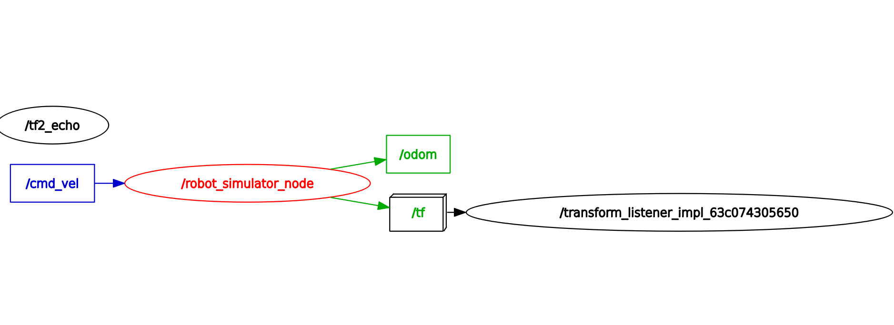

# robot_motion_sim

## Overview

`robot_motion_sim` is a ROS 2 C++ package that simulates the planar motion of a mobile robot.

The simulator receives velocity commands from `/cmd_vel`, updates the robot state in a timer-based simulation loop, and publishes the robot state in multiple ROS 2 standard formats:

- `nav_msgs/msg/Odometry` on `/odom`
- `tf2_msgs/msg/TFMessage` on `/tf`

The robot position is represented in the `odom` frame, while `base_link` is used as the robot's child frame.

The main frame relationship is:
```text
odom -> base_link
```

This project demonstrates core ROS 2 concepts such as:

- Publishers and subscribers
- Standard ROS 2 message types
- Timer-based simulation
- ROS 2 parameters
- Velocity command timeout logic
- Yaw-to-quaternion conversion
- Odometry publishing
- TF broadcasting
- Reusing a standalone C++ `MobileRobot` model inside a ROS 2 node

## Features

- Subscribes to velocity commands on `/cmd_vel`
- Publishes standard odometry messages on `/odom`
- Publishes TF transform from `odom` to `base_link` on `/tf`
- Simulates planar mobile robot motion
- Converts the robot yaw angle to a quaternion
- Uses configurable frame identifiers
- Runs the simulation using a configurable timer
- Stops the robot when velocity commands become stale
- Reuses the C++ `MobileRobot` model

## Topics

### Published Topics

#### `/odom`

Message type:

```text
nav_msgs/msg/Odometry
```

Contains the current simulated robot pose and velocity.

Frame information:

- `header.frame_id`: usually `odom`
- `child_frame_id`: usually `base_link`

The exact frame names can be configured using parameters.

Published pose fields:

- `pose.pose.position.x`: robot position on the x-axis
- `pose.pose.position.y`: robot position on the y-axis
- `pose.pose.position.z`: always `0.0`
- `pose.pose.orientation`: robot yaw represented as a quaternion

Published twist fields:

- `twist.twist.linear.x`: current forward or backward velocity
- `twist.twist.angular.z`: current yaw angular velocity

#### `/tf`

Message type:

```text
tf2_msgs/msg/TFMessage
```

Publishes the transform between the odometry frame and the robot base frame.

Default transform relationship:

```text
odom -> base_link
```

The transform contains:

- Translation:
  - `x`: robot x position
  - `y`: robot y position
  - `z`: `0.0`
- Rotation:
  - robot yaw converted to quaternion

This allows ROS 2 tools such as `tf2_echo`, RViz, navigation tools, and other TF-aware nodes to query the robot pose using the TF tree.

### Subscribed Topics

#### `/cmd_vel`

Message type:

```text
geometry_msgs/msg/Twist
```

Provides velocity commands for the simulated robot.

Used fields:

- `linear.x`: forward or backward linear velocity
- `angular.z`: yaw angular velocity

Other fields in the message are currently ignored.

## Coordinate Frames

The simulator uses the following coordinate frames:

```text
odom
base_link
```

The default TF relationship is:

```text
odom -> base_link
```

The robot position and orientation are expressed relative to the `odom` frame.

By default:

- `odom` is the parent frame.
- `base_link` is the robot body frame.

These names can be changed using the following parameters:

- `odom_frame_id`
- `base_frame_id`

The same frame names are used consistently in:

- `/odom`
- `/tf`

## Parameters

### `update_rate_hz`

Simulation update frequency in hertz.

Default value:

```text
20.0
```

If a non-positive value is provided, the node prints a warning and falls back to `20.0` Hz.

### `command_timeout`

Maximum time in seconds that the simulator waits for a new `/cmd_vel` message.

If no new velocity command is received within this duration, the linear and angular velocities are set to zero.

Default value:

```text
0.5
```

### `odom_frame_id`

Name of the odometry/world frame.

Default value:

```text
odom
```

This value is used as:

- `header.frame_id` in `/odom`
- parent frame in the TF transform published on `/tf`

### `base_frame_id`

Name of the robot base frame.

Default value:

```text
base_link
```

This value is used as:

- `child_frame_id` in `/odom`
- child frame in the TF transform published on `/tf`

### Parameter Example

```bash
ros2 run robot_motion_sim robot_simulator_node --ros-args \
  -p update_rate_hz:=20.0 \
  -p command_timeout:=0.5 \
  -p odom_frame_id:=odom \
  -p base_frame_id:=base_link
```

## Dependencies

The package uses the following ROS 2 dependencies:

- `rclcpp`
- `geometry_msgs`
- `nav_msgs`
- `tf2`
- `tf2_ros`
- `tf2_msgs`

`tf2` is used to convert the robot yaw angle into a quaternion.

`tf2_ros` is used to broadcast the transform between `odom` and `base_link`.

## Build

From the root of the ROS 2 workspace:

```bash
colcon build --packages-select robot_motion_sim
```

Source the workspace after building:

```bash
source install/setup.bash
```

## Run

Run the robot simulator node:

```bash
ros2 run robot_motion_sim robot_simulator_node
```

## Test

Open several terminals and source the workspace in each terminal:

```bash
source install/setup.bash
```

### Terminal 1: Run the simulator

```bash
ros2 run robot_motion_sim robot_simulator_node
```

### Terminal 2: Publish velocity commands

```bash
ros2 topic pub --rate 10 /cmd_vel geometry_msgs/msg/Twist \
"{linear: {x: 0.4}, angular: {z: 0.3}}"
```

This command requests:

- A linear velocity of `0.4`
- An angular velocity of `0.3`

### Terminal 3: Inspect odometry

```bash
ros2 topic echo /odom
```

The output should contain:

- A changing robot position
- A quaternion representing the robot orientation
- The commanded linear velocity
- The commanded angular velocity
- `odom` as the parent frame by default
- `base_link` as the child frame by default

### Terminal 4: Inspect TF

```bash
ros2 run tf2_ros tf2_echo odom base_link
```

The output should show the transform from `odom` to `base_link`.

Example information shown by `tf2_echo`:

- Translation between the frames
- Rotation as a quaternion
- Rotation as roll, pitch, and yaw

If the robot is moving, the translation and yaw values should change over time.

## Additional Inspection Commands

### Display topic information

```bash
ros2 topic info /odom
ros2 topic info /tf
```

### Display message definitions

```bash
ros2 interface show nav_msgs/msg/Odometry
ros2 interface show tf2_msgs/msg/TFMessage
```

### Check the odometry publishing rate

```bash
ros2 topic hz /odom
```

The measured rate should be close to the configured `update_rate_hz`.

### Check the TF publishing rate

```bash
ros2 topic hz /tf
```

The measured rate should also be close to the configured `update_rate_hz`.

### List active topics

```bash
ros2 topic list
```

Expected topics include:

```text
/cmd_vel
/odom
/tf
```

Other standard ROS 2 topics such as `/parameter_events` and `/rosout` may also appear.

### Display node information

```bash
ros2 node info /robot_simulator_node
```

This command shows the publishers, subscribers, and services associated with the simulator node.

## ROS 2 Graph

The expected ROS 2 communication graph is:

```text
/cmd_vel  --->  /robot_simulator_node  --->  /odom
                                      |
                                      ----->  /tf
```

When `tf2_echo` is also running:

```bash
ros2 run tf2_ros tf2_echo odom base_link
```

the graph may also show nodes similar to:

```text
/tf2_echo
/transform_listener_impl_<id>
```

For example:

```text
/transform_listener_impl_63c074305650
```

This is normal.

`tf2_echo` is a command-line tool used to inspect the transform between two frames.

Internally, it creates a TF listener that subscribes to `/tf`. In `rqt_graph`, this listener may appear as a separate node with a generated name such as:

```text
/transform_listener_impl_63c074305650
```

The `/tf2_echo` node may appear disconnected in the graph, while the internal transform listener is the node actually connected to `/tf`.

This does not indicate a problem with the simulator.

To inspect the ROS 2 graph:

```bash
rqt_graph
```

or:

```bash
ros2 run rqt_graph rqt_graph
```

Save the graph screenshot as:

```text
docs/rqt_graph.png
```

## Demo

Example graph with the simulator, odometry, TF, and `tf2_echo` running:



If the existing screenshot is outdated, regenerate it after running the updated node.

## Expected Behavior

When velocity commands are published on `/cmd_vel`, the simulator:

1. Reads `linear.x` and `angular.z`.
2. Updates the robot pose at the configured simulation rate.
3. Converts the robot heading angle to a quaternion.
4. Publishes the current pose and velocity on `/odom`.
5. Publishes the `odom -> base_link` transform on `/tf`.

When velocity commands stop arriving, the robot continues using the last received command until `command_timeout` expires.

After the timeout expires:

- Linear velocity becomes zero.
- Angular velocity becomes zero.
- The simulated robot stops moving.
- `/odom` continues to be published with zero velocity.
- `/tf` continues to be published with the latest robot pose.

## Odometry Covariance

The `nav_msgs/msg/Odometry` message contains covariance matrices for both pose and twist.

Covariance fields are currently left at their default values for simplicity.

In a real robot or sensor-fusion system, these values should represent the uncertainty of the pose and velocity estimates.

Correct covariance values become especially important when using tools such as:

- Extended Kalman filters
- Robot localization
- Sensor fusion
- Navigation systems

## Package Structure

```text
robot_motion_sim/
├── CMakeLists.txt
├── docs
│   └── rqt_graph.png
├── include
│   └── robot_motion_sim
│       └── robot.hpp
├── package.xml
├── README.md
└── src
    ├── robot.cpp
    └── robot_simulator_node.cpp
```

The exact source file names may differ depending on the current project layout.

## Current Limitations

The current limitations are intentional and help define the scope of this simulation project.

They are not necessarily weaknesses; they document what is modeled and what is not modeled yet.

- Motion is simulated only in the 2D plane.
- Only `linear.x` and `angular.z` velocity commands are used.
- No wheel slip model.
- Odometry covariance is not modeled yet.
- No URDF or RViz robot visualization yet.
- The simulation uses a fixed time step calculated from `update_rate_hz`.
- The simulator does not model sensor noise or other advanced physical effects.

## Notes

This project is intended as a small ROS 2 mobile robot simulation exercise.

It focuses on:

- Clean ROS 2 node structure
- Standard ROS 2 odometry messages
- TF broadcasting
- Parameter usage
- Topic communication
- Safe handling of stale commands
- Separation of robot motion logic from ROS-specific code

## Summary

Published topics:

```text
/odom: nav_msgs/msg/Odometry
/tf: tf2_msgs/msg/TFMessage
```

Subscribed topics:

```text
/cmd_vel: geometry_msgs/msg/Twist
```

Frames:

```text
odom
base_link
```

Parameters:

```text
update_rate_hz
command_timeout
odom_frame_id
base_frame_id
```