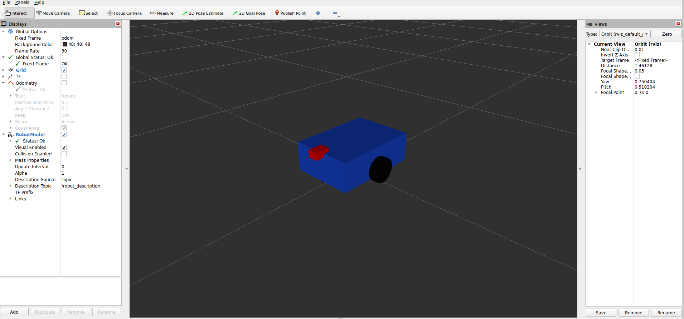

# robot_motion_sim

## Overview

`robot_motion_sim` is a ROS 2 C++ package for simulating planar mobile robot motion.

The simulator subscribes to velocity commands on `/cmd_vel`, updates the robot state in a timer-based loop, and publishes the robot state as pose, odometry, and TF.

The project now also includes a simple URDF robot model that is loaded through `robot_state_publisher` and visualized in RViz.

The main motion frame relationship is:
```text
odom -> base_link
```

The full robot model TF tree is:

```text
odom
└── base_link
├── left_wheel_link
├── right_wheel_link
├── caster_link
└── laser_link
```

This project demonstrates:

- ROS 2 publishers and subscribers
- Timer-based simulation
- ROS 2 parameters loaded from YAML
- Launch files for reproducible startup
- Odometry and TF publishing
- URDF robot description
- `robot_state_publisher`
- Robot model visualization in RViz
- Basic RViz visualization for TF, odometry, and RobotModel

## Features

- Subscribes to `/cmd_vel`
- Publishes `/robot_pose`
- Publishes `/odom`
- Publishes `/tf`
- Loads parameters from `config/sim_params.yaml`
- Starts the simulator with `ros2 launch`
- Optionally opens RViz with a saved configuration
- Stops the robot when commands become stale
- Loads a URDF robot model from `urdf/robot.urdf`
- Starts `robot_state_publisher`
- Displays the robot model in RViz
- Includes a simple front sensor frame: `laser_link`

## Build

From the root of the ROS 2 workspace:

```bash
colcon build --packages-select robot_motion_sim
source install/setup.bash
```

## Launch

Run simulator only:

```bash
ros2 launch robot_motion_sim sim.launch.py use_rviz:=false
```

Run simulator with RViz:

```bash
ros2 launch robot_motion_sim sim.launch.py use_rviz:=true
```

The launch file is located at:

```text
launch/sim.launch.py
```

The launch file starts:

- `robot_simulator_node`
- `robot_state_publisher`
- `rviz2`, optionally controlled by `use_rviz`

## System Flow

```text
/cmd_vel
   ↓
robot_simulator_node
   ↓
/odom + /tf
```

```text
urdf/robot.urdf
   ↓
robot_description
   ↓
robot_state_publisher
   ↓
robot model TF frames
   ↓
RViz RobotModel
```

## Configuration

Parameters are stored in:

```text
config/sim_params.yaml
```

Current parameters:

```yaml
robot_simulator_node:
  ros__parameters:
update_rate_hz: 20.0
command_timeout: 0.5
odom_frame_id: "odom"
base_frame_id: "base_link"
```

You can inspect the loaded parameters with:

```bash
ros2 param list /robot_simulator_node
ros2 param get /robot_simulator_node update_rate_hz
ros2 param get /robot_simulator_node odom_frame_id
ros2 param get /robot_simulator_node base_frame_id
```

## Robot Model

The robot model is described using URDF:

```text
urdf/robot.urdf
```

The model includes:

- `base_link`
- `left_wheel_link`
- `right_wheel_link`
- `caster_link`
- `laser_link`

The `base_link` name in the URDF must match the simulator `base_frame_id`, because the simulator publishes:

```text
odom -> base_link
```

The robot body is represented by a simple box.

The wheels are represented by cylinders.

The caster is represented by a small sphere.

The front sensor frame is represented by a small red box named:

```text
laser_link
```

Currently, the wheel joints are fixed joints. In future versions, they can be changed to continuous joints and animated using joint states.

## Robot State Publisher

The launch file starts `robot_state_publisher` and loads the URDF into the `robot_description` parameter.

You can check that the URDF was loaded correctly with:

```bash
ros2 param get /robot_state_publisher robot_description
```

Expected node list after launching with RViz:

```bash
ros2 node list
```

Example output:

```text
/robot_simulator_node
/robot_state_publisher
/rviz2
```

## TF Tree

The simulator publishes the moving transform:

```text
odom -> base_link
```

`robot_state_publisher` publishes the fixed transforms from the URDF:

```text
base_link -> left_wheel_link
base_link -> right_wheel_link
base_link -> caster_link
base_link -> laser_link
```

Complete tree:

```text
odom
└── base_link
├── left_wheel_link
├── right_wheel_link
├── caster_link
└── laser_link
```

You can inspect transforms with:

```bash
ros2 run tf2_ros tf2_echo odom base_link
```

```bash
ros2 run tf2_ros tf2_echo base_link left_wheel_link
```

```bash
ros2 run tf2_ros tf2_echo base_link right_wheel_link
```

```bash
ros2 run tf2_ros tf2_echo base_link caster_link
```

```bash
ros2 run tf2_ros tf2_echo base_link laser_link
```

## RViz

RViz configuration is stored in:

```text
rviz/sim.rviz
```

Launch RViz automatically with:

```bash
ros2 launch robot_motion_sim sim.launch.py use_rviz:=true
```

If you want to open RViz manually:

```bash
rviz2
```

Expected RViz setup:

- Fixed Frame: `odom`
- Display `TF`
- Display `Odometry` on topic `/odom`
- Display `RobotModel`

For the RobotModel display, depending on the ROS 2/RViz version, check that the robot description source is correctly configured.

Common working setup:

```text
Description Source: Topic
Description Topic: /robot_description
```

or, in some RViz versions, RobotModel may read the `robot_description` parameter from `robot_state_publisher`.

Screenshots:




## Frames

Main frames:

```text
odom -> base_link
```

Robot model frames:

```text
base_link -> left_wheel_link
base_link -> right_wheel_link
base_link -> caster_link
base_link -> laser_link
```

Frame descriptions:

- `odom`: world/odometry frame
- `base_link`: main robot body frame
- `left_wheel_link`: left wheel frame
- `right_wheel_link`: right wheel frame
- `caster_link`: rear caster frame
- `laser_link`: front sensor frame for future LiDAR/sensor integration

## Topics

Published:

- `/robot_pose`
- `/odom`
- `/tf`
- `/tf_static`
- `/robot_description`, depending on `robot_state_publisher` behavior and ROS 2 version

Subscribed:

- `/cmd_vel`

## Topic Types

- `/robot_pose`: project pose message published by the simulator node
- `/odom`: `nav_msgs/msg/Odometry`
- `/tf`: `tf2_msgs/msg/TFMessage`
- `/tf_static`: `tf2_msgs/msg/TFMessage`
- `/cmd_vel`: `geometry_msgs/msg/Twist`

## Parameters

### `update_rate_hz`

Simulation update frequency in hertz.

Default:

```text
20.0
```

### `command_timeout`

Maximum time in seconds to wait for a new `/cmd_vel` command before stopping the robot.

Default:

```text
0.5
```

### `odom_frame_id`

Odometry/world frame name.

Default:

```text
odom
```

### `base_frame_id`

Robot base frame name.

Default:

```text
base_link
```

Important:

The value of `base_frame_id` should match the main link name in the URDF:

```xml
<link name="base_link">
```

If these names do not match, the robot model may not attach correctly to the moving TF tree in RViz.

## Test

Open multiple terminals and source the workspace in each one:

```bash
source install/setup.bash
```

### Terminal 1

Start the simulator with RViz:

```bash
ros2 launch robot_motion_sim sim.launch.py use_rviz:=true
```

Or start without RViz:

```bash
ros2 launch robot_motion_sim sim.launch.py use_rviz:=false
```

### Terminal 2

Check the nodes:

```bash
ros2 node list
```

Expected nodes include:

```text
/robot_simulator_node
/robot_state_publisher
```

If RViz is enabled:

```text
/rviz2
```

### Terminal 3

Check the topics:

```bash
ros2 topic list
```

Expected topics include:

```text
/cmd_vel
/odom
/robot_pose
/tf
/tf_static
```
Depending on the ROS 2 version and `robot_state_publisher` behavior, you may also see:

```text
/robot_description
```

### Terminal 4

Inspect odometry:

```bash
ros2 topic echo /odom
```

### Terminal 5

Send velocity commands:

```bash
ros2 topic pub --rate 10 /cmd_vel geometry_msgs/msg/Twist \
"{linear: {x: 0.4}, angular: {z: 0.2}}"
```

The robot should move, `/odom` should change over time, and RViz should show the robot model moving relative to `odom`.

## Robot Description Test

Check that `robot_state_publisher` received the URDF:

```bash
ros2 param get /robot_state_publisher robot_description
```

If the URDF text is printed, the robot description was loaded successfully.

## TF Tests

Check the simulator transform:

```bash
ros2 run tf2_ros tf2_echo odom base_link
```

Check the URDF fixed transforms:

```bash
ros2 run tf2_ros tf2_echo base_link left_wheel_link
```

```bash
ros2 run tf2_ros tf2_echo base_link right_wheel_link
```

```bash
ros2 run tf2_ros tf2_echo base_link caster_link
```

```bash
ros2 run tf2_ros tf2_echo base_link laser_link
```

## Expected Behavior

When commands are published on `/cmd_vel`, the simulator:

1. Reads `linear.x` and `angular.z`.
2. Updates the robot pose at the configured rate.
3. Publishes pose information on `/robot_pose`.
4. Publishes odometry on `/odom`.
5. Publishes the transform `odom -> base_link` on `/tf`.
6. The URDF model remains attached to `base_link` through `robot_state_publisher`.
7. RViz displays TF, odometry, and the full robot model.

If commands stop arriving for longer than `command_timeout`, the robot velocities are reset to zero and the robot stops.

## Troubleshooting

### Robot model does not appear in RViz

Check:

```bash
ros2 param get /robot_state_publisher robot_description
```

```bash
ros2 run tf2_ros tf2_echo odom base_link
```

```bash
ros2 run tf2_ros tf2_echo base_link left_wheel_link
```

Also check in RViz:

- Fixed Frame is set to `odom`
- `RobotModel` display is added
- Robot description source is configured correctly
- URDF file is installed correctly
- `robot_state_publisher` is running

### RobotModel appears but does not move

Check that the simulator is publishing:

```text
odom -> base_link
```

Run:

```bash
ros2 run tf2_ros tf2_echo odom base_link
```

If this transform does not update while sending `/cmd_vel`, the simulator TF publishing should be checked.

### Wheel or sensor frames do not appear

Check the fixed transforms:

```bash
ros2 run tf2_ros tf2_echo base_link left_wheel_link
ros2 run tf2_ros tf2_echo base_link right_wheel_link
ros2 run tf2_ros tf2_echo base_link caster_link
ros2 run tf2_ros tf2_echo base_link laser_link
```

If they are missing, check:

- `urdf/robot.urdf`
- `robot_state_publisher`
- `robot_description` parameter
- installation of the `urdf` directory in `CMakeLists.txt`

## Package Structure

```text
robot_motion_sim/
├── CMakeLists.txt
├── config/
│   └── sim_params.yaml
├── docs/
│   ├── rviz_tf_odom.png
│   └── rviz_robot_model.png
├── include/
├── launch/
│   └── sim.launch.py
├── package.xml
├── README.md
├── rviz/
│   └── sim.rviz
├── src/
    └── urdf/
    └── robot.urdf
```

## Dependencies

Main ROS 2 dependencies used by this package:

- `rclcpp`
- `geometry_msgs`
- `nav_msgs`
- `tf2`
- `tf2_ros`
- `tf2_msgs`
- `robot_state_publisher`
- `joint_state_publisher`
- `launch`
- `launch_ros`
- `ament_index_python`
- `rviz2`

## Install Notes

The launch, config, RViz, and URDF directories should be installed from `CMakeLists.txt`:

```cmake
install(
  DIRECTORY launch config rviz urdf
  DESTINATION share/${PROJECT_NAME}
)
```

This allows the launch file to find:

```text
config/sim_params.yaml
rviz/sim.rviz
urdf/robot.urdf
```

from the installed package share directory.

## Notes

- This simulator models motion only in 2D.
- The main command inputs are `linear.x` and `angular.z`.
- The robot model is described using URDF.
- The current wheel joints are fixed.
- `laser_link` is included as a simple front sensor frame for future sensor integration.
- Covariance values in odometry are kept simple for now.
