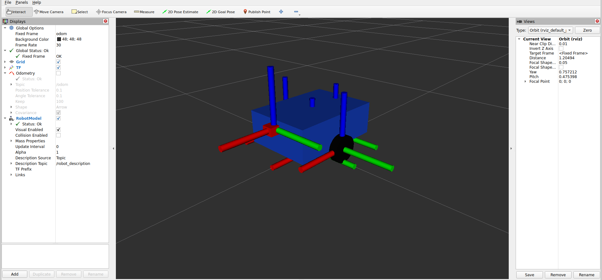
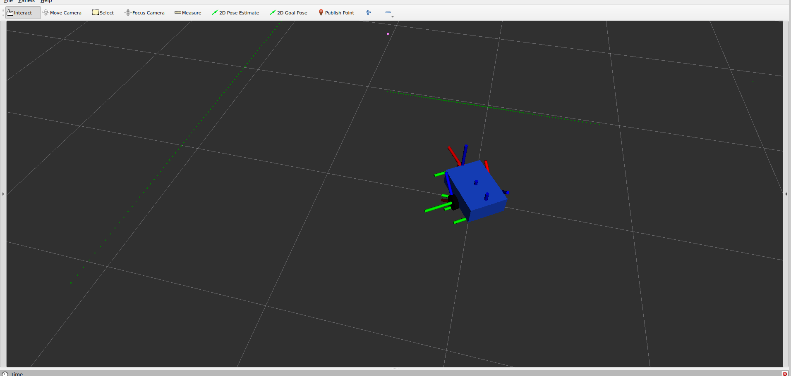

# robot_motion_sim

## Overview

`robot_motion_sim` is a ROS 2 C++ package for simulating planar mobile robot motion.

The simulator subscribes to velocity commands on `/cmd_vel`, updates the robot state in a timer-based loop, and publishes the robot state as odometry, TF, and wheel joint states.

The project includes a simple Xacro-based robot model that is loaded through `robot_state_publisher` and visualized in RViz.

The main motion frame relationship is:
```text
odom -> base_link
```

The full robot model TF tree is:

```text
odom
└── base_link
├── left_wheel_link
├── right_wheel_link
├── caster_link
└── laser_link
```

This project demonstrates:

- ROS 2 publishers and subscribers
- Timer-based simulation
- ROS 2 parameters loaded from YAML
- Launch files for reproducible startup
- Custom launch arguments
- Odometry and TF publishing
- Xacro robot description
- `robot_state_publisher`
- Wheel joint state publishing
- Differential drive wheel kinematics
- Robot model visualization in RViz
- Basic RViz visualization for TF, odometry, and RobotModel

## Features

- Subscribes to `/cmd_vel`
- Publishes `/odom`
- Publishes `/tf`
- Publishes `/joint_states`
- Loads parameters from `config/sim_params.yaml`
- Supports custom parameter files through launch argument `params_file`
- Starts the simulator with `ros2 launch`
- Optionally opens RViz with a saved configuration
- Stops the robot when commands become stale
- Loads a robot model from `urdf/robot.urdf.xacro`
- Starts `robot_state_publisher`
- Displays the robot model in RViz
- Animates wheel joints using `sensor_msgs/msg/JointState`
- Includes a simple front sensor frame: `laser_link`

## Build

From the root of the ROS 2 workspace:

```bash
colcon build --packages-select robot_motion_sim
source install/setup.bash
```

## Launch

Run simulator only:

```bash
ros2 launch robot_motion_sim sim.launch.py use_rviz:=false
```

Run simulator with RViz:

```bash
ros2 launch robot_motion_sim sim.launch.py use_rviz:=true
```

Use a custom parameter file:

```bash
ros2 launch robot_motion_sim sim.launch.py \
  use_rviz:=true \
  params_file:=/path/to/custom_params.yaml
```

Example using the package config file explicitly:

```bash
ros2 launch robot_motion_sim sim.launch.py \
  use_rviz:=false \
  params_file:=$HOME/ros2_ws/src/robot_motion_sim/config/sim_params.yaml
```

The launch file is located at:

```text
launch/sim.launch.py
```

The launch file starts:

- `robot_simulator_node`
- `robot_state_publisher`
- `rviz2`, optionally controlled by `use_rviz`

## Launch Arguments

### `use_rviz`

Controls whether RViz is started.

Default:

```text
true
```

Examples:

```bash
ros2 launch robot_motion_sim sim.launch.py use_rviz:=true
```

```bash
ros2 launch robot_motion_sim sim.launch.py use_rviz:=false
```

### `params_file`

Path to the simulator parameters file.

Default:

```text
config/sim_params.yaml
```

Example:

```bash
ros2 launch robot_motion_sim sim.launch.py \
  use_rviz:=true \
  params_file:=/path/to/custom_params.yaml
```

## System Flow

```text
/cmd_vel
   ↓
robot_simulator_node
   ↓
/odom + /tf + /joint_states
```

```text
urdf/robot.urdf.xacro
   ↓
robot_description
   ↓
robot_state_publisher
   ↓
robot model TF frames
   ↓
RViz RobotModel
```

## Configuration

Parameters are stored in:

```text
config/sim_params.yaml
```

Current parameters:

```yaml
robot_simulator_node:
  ros__parameters:
update_rate_hz: 20.0
command_timeout: 0.5
odom_frame_id: "odom"
base_frame_id: "base_link"
wheel_radius: 0.05
wheel_base: 0.28
left_wheel_joint_name: "left_wheel_joint"
right_wheel_joint_name: "right_wheel_joint"
```

You can inspect the loaded parameters with:

```bash
ros2 param list /robot_simulator_node
```

```bash
ros2 param get /robot_simulator_node update_rate_hz
ros2 param get /robot_simulator_node command_timeout
ros2 param get /robot_simulator_node odom_frame_id
ros2 param get /robot_simulator_node base_frame_id
ros2 param get /robot_simulator_node wheel_radius
ros2 param get /robot_simulator_node wheel_base
ros2 param get /robot_simulator_node left_wheel_joint_name
ros2 param get /robot_simulator_node right_wheel_joint_name
```

## Xacro Robot Description

The robot model is generated from:

```text
urdf/robot.urdf.xacro
```

The Xacro model defines:

- base dimensions
- wheel radius
- wheel width
- wheel positions
- caster link
- laser link
- continuous wheel joints

Typical Xacro geometry values should be kept consistent with the simulator YAML parameters.

For example, if the wheel lateral offset in Xacro is:

```xml
<xacro:property name="wheel_y_offset" value="0.14"/>
```

Then the wheel base should be approximately:

```text
wheel_base = 0.28
```

So the YAML should contain:

```yaml
wheel_base: 0.28
```

If the wheel radius in Xacro is:

```xml
<xacro:property name="wheel_radius" value="0.05"/>
```

Then the YAML should contain:

```yaml
wheel_radius: 0.05
```

Currently, Xacro and YAML values are kept synchronized manually.

## Robot Model

The robot model is described using Xacro:

```text
urdf/robot.urdf.xacro
```

The model includes:

- `base_link`
- `left_wheel_link`
- `right_wheel_link`
- `caster_link`
- `laser_link`

The `base_link` name in the Xacro model must match the simulator `base_frame_id`, because the simulator publishes:

```text
odom -> base_link
```

The robot body is represented by a simple box.

The wheels are represented by cylinders.

The wheel joints are continuous joints:

```text
left_wheel_joint
right_wheel_joint
```

The caster is represented by a small sphere.

The front sensor frame is represented by a small red box named:

```text
laser_link
```

## Joint States

The simulator publishes wheel joint states on:

```text
/joint_states
```

Message type:

```text
sensor_msgs/msg/JointState
```

Joints:

- `left_wheel_joint`
- `right_wheel_joint`

The published joint state contains:

- `name`
- `position`
- `velocity`

Example structure:

```yaml
name:
- left_wheel_joint
- right_wheel_joint
position:
- ...
- ...
velocity:
- ...
- ...
```

The wheel joint positions are integrated over time from the wheel angular velocities.

## Differential Drive Wheel Kinematics

The simulator uses differential drive kinematics to compute wheel rotation from robot linear and angular velocity.

Variables:

```text
v = robot linear velocity
ω = robot angular velocity
L = wheel_base
r = wheel_radius
```

Wheel linear velocities are computed as:

```text
v_left  = v - ωL/2
v_right = v + ωL/2
```

Wheel angular velocities are computed as:

```text
ω_left_wheel  = v_left / r
ω_right_wheel = v_right / r
```

Wheel positions are integrated as:

```text
left_position  += ω_left_wheel  * dt
right_position += ω_right_wheel * dt
```

For straight motion:

```text
linear.x > 0
angular.z = 0
```

Both wheels should rotate with approximately equal velocity.

For in-place rotation:

```text
linear.x = 0
angular.z != 0
```

The left and right wheels should rotate in opposite directions.

For curved motion:

```text
linear.x != 0
angular.z != 0
```

The two wheels should rotate with different velocities.

## Robot State Publisher

The launch file starts `robot_state_publisher` and loads the generated robot description into the `robot_description` parameter.

The robot description is generated from the Xacro file:

```text
urdf/robot.urdf.xacro
```

You can check that the robot description was loaded correctly with:

```bash
ros2 param get /robot_state_publisher robot_description
```

Expected node list after launching with RViz:

```bash
ros2 node list
```

Example output:

```text
/robot_simulator_node
/robot_state_publisher
/rviz2
```

## TF Tree

The simulator publishes the moving transform:

```text
odom -> base_link
```

`robot_state_publisher` publishes the robot model transforms from the robot description:

```text
base_link -> left_wheel_link
base_link -> right_wheel_link
base_link -> caster_link
base_link -> laser_link
```

Complete tree:

```text
odom
└── base_link
├── left_wheel_link
├── right_wheel_link
├── caster_link
└── laser_link
```

You can inspect transforms with:

```bash
ros2 run tf2_ros tf2_echo odom base_link
```

```bash
ros2 run tf2_ros tf2_echo base_link left_wheel_link
```

```bash
ros2 run tf2_ros tf2_echo base_link right_wheel_link
```

```bash
ros2 run tf2_ros tf2_echo base_link caster_link
```

```bash
ros2 run tf2_ros tf2_echo base_link laser_link
```

## RViz

RViz configuration is stored in:

```text
rviz/sim.rviz
```

Launch RViz automatically with:

```bash
ros2 launch robot_motion_sim sim.launch.py use_rviz:=true
```

If you want to open RViz manually:

```bash
rviz2
```

Expected RViz setup:

- Fixed Frame: `odom`
- Display `TF`
- Display `Odometry` on topic `/odom`
- Display `RobotModel`

For the RobotModel display, depending on the ROS 2/RViz version, check that the robot description source is correctly configured.

Common working setup:

```text
Description Source: Topic
Description Topic: /robot_description
```

or, in some RViz versions, RobotModel may read the `robot_description` parameter from `robot_state_publisher`.

Screenshots:






## Frames

Main frames:

```text
odom -> base_link
```

Robot model frames:

```text
base_link -> left_wheel_link
base_link -> right_wheel_link
base_link -> caster_link
base_link -> laser_link
```

Frame descriptions:

- `odom`: world/odometry frame
- `base_link`: main robot body frame
- `left_wheel_link`: left wheel frame
- `right_wheel_link`: right wheel frame
- `caster_link`: rear caster frame
- `laser_link`: front sensor frame for future LiDAR/sensor integration

## Topics

Published by the simulator node:

- `/odom`
- `/tf`
- `/joint_states`

Published by `robot_state_publisher` and TF-related nodes:

- `/tf_static`
- `/robot_description`, depending on ROS 2 version and `robot_state_publisher` behavior

Subscribed by the simulator node:

- `/cmd_vel`

## Topic Types

- `/odom`: `nav_msgs/msg/Odometry`
- `/tf`: `tf2_msgs/msg/TFMessage`
- `/tf_static`: `tf2_msgs/msg/TFMessage`
- `/joint_states`: `sensor_msgs/msg/JointState`
- `/cmd_vel`: `geometry_msgs/msg/Twist`

## Parameters

### `update_rate_hz`

Simulation update frequency in hertz.

Default:

```text
20.0
```

### `command_timeout`

Maximum time in seconds to wait for a new `/cmd_vel` command before stopping the robot.

Default:

```text
0.5
```

### `odom_frame_id`

Odometry/world frame name.

Default:

```text
odom
```

### `base_frame_id`

Robot base frame name.

Default:

```text
base_link
```

Important:

The value of `base_frame_id` should match the main link name in the Xacro model:

```xml
<link name="base_link">
```

If these names do not match, the robot model may not attach correctly to the moving TF tree in RViz.

### `wheel_radius`

Wheel radius in meters.

Default:

```text
0.05
```

This value is used to convert wheel linear velocity to wheel angular velocity:

```text
wheel_angular_velocity = wheel_linear_velocity / wheel_radius
```

This value should match the wheel radius used in the Xacro model.

### `wheel_base`

Distance between the left and right wheels in meters.

Default:

```text
0.28
```

For a differential drive robot, this value is used to compute left and right wheel velocities from the commanded robot velocity.

If the Xacro model uses:

```text
wheel_y_offset = 0.14
```

then the wheel base should be approximately:

```text
wheel_base = 0.28
```

### `left_wheel_joint_name`

Name of the left wheel joint.

Default:

```text
left_wheel_joint
```

This must match the joint name in the Xacro model.

### `right_wheel_joint_name`

Name of the right wheel joint.

Default:

```text
right_wheel_joint
```

This must match the joint name in the Xacro model.

## Test

Open multiple terminals and source the workspace in each one:

```bash
source install/setup.bash
```

### Terminal 1

Start the simulator with RViz:

```bash
ros2 launch robot_motion_sim sim.launch.py use_rviz:=true
```

Or start without RViz:

```bash
ros2 launch robot_motion_sim sim.launch.py use_rviz:=false
```

### Terminal 2

Check the nodes:

```bash
ros2 node list
```

Expected nodes include:

```text
/robot_simulator_node
/robot_state_publisher
```

If RViz is enabled:

```text
/rviz2
```

### Terminal 3

Check the topics:

```bash
ros2 topic list
```

Expected topics include:

```text
/cmd_vel
/odom
/tf
/tf_static
/joint_states
```

Depending on the ROS 2 version and `robot_state_publisher` behavior, you may also see:

```text
/robot_description
```

### Terminal 4

Inspect odometry:

```bash
ros2 topic echo /odom
```

### Terminal 5

Inspect joint states:

```bash
ros2 topic echo /joint_states
```

Expected message fields:

```yaml
name:
- left_wheel_joint
- right_wheel_joint
position:
- ...
- ...
velocity:
- ...
- ...
```

### Terminal 6

Send velocity commands.

Straight motion:

```bash
ros2 topic pub --rate 10 /cmd_vel geometry_msgs/msg/Twist \
"{linear: {x: 0.3}, angular: {z: 0.0}}"
```

Expected behavior:

- The robot moves straight.
- Both wheels rotate with approximately equal velocity.
- `/joint_states` velocity values are approximately equal.

In-place rotation:

```bash
ros2 topic pub --rate 10 /cmd_vel geometry_msgs/msg/Twist \
"{linear: {x: 0.0}, angular: {z: 0.8}}"
```

Expected behavior:

- The robot rotates in place.
- The left and right wheels rotate in opposite directions.
- `/joint_states` velocity values have opposite signs.

Curved motion:

```bash
ros2 topic pub --rate 10 /cmd_vel geometry_msgs/msg/Twist \
"{linear: {x: 0.3}, angular: {z: 0.5}}"
```

Expected behavior:

- The robot moves on a curved path.
- The left and right wheels rotate with different velocities.

## Joint State Tests

Check `/joint_states`:

```bash
ros2 topic echo /joint_states
```

Check the publishing rate:

```bash
ros2 topic hz /joint_states
```

If `update_rate_hz` is set to:

```yaml
update_rate_hz: 20.0
```

then `/joint_states` should be published at approximately:

```text
20 Hz
```

For straight motion, wheel velocities should be approximately equal.

For in-place rotation, wheel velocities should have opposite signs.

## Robot Description Test

Check that `robot_state_publisher` received the robot description:

```bash
ros2 param get /robot_state_publisher robot_description
```

If the generated robot description text is printed, the Xacro model was loaded successfully.

## TF Tests

Check the simulator transform:

```bash
ros2 run tf2_ros tf2_echo odom base_link
```

Check the robot model transforms:

```bash
ros2 run tf2_ros tf2_echo base_link left_wheel_link
```

```bash
ros2 run tf2_ros tf2_echo base_link right_wheel_link
```

```bash
ros2 run tf2_ros tf2_echo base_link caster_link
```

```bash
ros2 run tf2_ros tf2_echo base_link laser_link
```

## Expected Behavior

When commands are published on `/cmd_vel`, the simulator:

1. Reads `linear.x` and `angular.z`.
2. Applies command timeout safety.
3. Updates the robot pose internally at the configured rate.
4. Computes differential drive wheel velocities.
5. Integrates wheel joint positions.
6. Publishes odometry on `/odom`.
7. Publishes the transform `odom -> base_link` on `/tf`.
8. Publishes wheel joint states on `/joint_states`.
9. The Xacro robot model remains attached to `base_link` through `robot_state_publisher`.
10. RViz displays TF, odometry, the robot model, and animated wheels.

If commands stop arriving for longer than `command_timeout`, the robot velocities are reset to zero and the robot stops.

When the robot stops, wheel velocities become zero and wheel joint positions stop changing.

## Troubleshooting

### Robot model does not appear in RViz

Check:

```bash
ros2 param get /robot_state_publisher robot_description
```

```bash
ros2 run tf2_ros tf2_echo odom base_link
```

```bash
ros2 run tf2_ros tf2_echo base_link left_wheel_link
```

Also check in RViz:

- Fixed Frame is set to `odom`
- `RobotModel` display is added
- Robot description source is configured correctly
- Xacro file is installed correctly
- `robot_state_publisher` is running

### RobotModel appears but does not move

Check that the simulator is publishing:

```text
odom -> base_link
```

Run:

```bash
ros2 run tf2_ros tf2_echo odom base_link
```

If this transform does not update while sending `/cmd_vel`, the simulator TF publishing should be checked.

### Wheels do not rotate in RViz

Check that `/joint_states` is being published:

```bash
ros2 topic echo /joint_states
```

Check the publishing rate:

```bash
ros2 topic hz /joint_states
```

Check that the joint names in YAML match the joint names in the Xacro model:

```yaml
left_wheel_joint_name: "left_wheel_joint"
right_wheel_joint_name: "right_wheel_joint"
```

The Xacro model should define matching joints:

```xml
<joint name="left_wheel_joint" type="continuous">
```

```xml
<joint name="right_wheel_joint" type="continuous">
```

If the names do not match, `robot_state_publisher` will not be able to apply the joint states to the robot model correctly.

### One wheel appears to rotate in the wrong visual direction

This can happen because of the joint axis direction or the wheel visual geometry orientation.

Check the wheel joint axis in the Xacro model:

```xml
<axis xyz="0 1 0"/>
```

For simple educational simulation, the most important part is that:

- joint names match
- `/joint_states` is published
- wheel velocities follow differential drive kinematics
- the robot moves correctly in RViz

If needed, the right wheel joint axis can be adjusted in the Xacro model.

### Wheel or sensor frames do not appear

Check the transforms:

```bash
ros2 run tf2_ros tf2_echo base_link left_wheel_link
ros2 run tf2_ros tf2_echo base_link right_wheel_link
ros2 run tf2_ros tf2_echo base_link caster_link
ros2 run tf2_ros tf2_echo base_link laser_link
```

If they are missing, check:

- `urdf/robot.urdf.xacro`
- `robot_state_publisher`
- `robot_description` parameter
- installation of the `urdf` directory in `CMakeLists.txt`

### Custom params file is not applied

Run:

```bash
ros2 param get /robot_simulator_node wheel_radius
ros2 param get /robot_simulator_node wheel_base
```

Make sure the custom file has the correct node name:

```yaml
robot_simulator_node:
  ros__parameters:
wheel_radius: 0.05
wheel_base: 0.28
```

Launch with:

```bash
ros2 launch robot_motion_sim sim.launch.py \
  use_rviz:=false \
  params_file:=/path/to/custom_params.yaml
```

## Package Structure

```text
robot_motion_sim/
├── CMakeLists.txt
├── config/
│   └── sim_params.yaml
├── docs/
│   ├── rviz_tf_odom.png
│   └── rviz_robot_model.png
├── include/
│   └── robot_motion_sim/
├── launch/
│   └── sim.launch.py
├── package.xml
├── README.md
├── rviz/
│   └── sim.rviz
├── src/
│   └── robot_simulator_node.cpp
└── urdf/
   └── robot.urdf.xacro
```

## Dependencies

Main ROS 2 dependencies used by this package:

- `rclcpp`
- `geometry_msgs`
- `nav_msgs`
- `sensor_msgs`
- `tf2`
- `tf2_ros`
- `tf2_msgs`
- `robot_state_publisher`
- `launch`
- `launch_ros`
- `ament_index_python`
- `rviz2`
- `xacro`

## Install Notes

The launch, config, RViz, and URDF directories should be installed from `CMakeLists.txt`:

```cmake
install(
  DIRECTORY launch config rviz urdf
  DESTINATION share/${PROJECT_NAME}
)
```

This allows the launch file to find:

```text
config/sim_params.yaml
rviz/sim.rviz
urdf/robot.urdf.xacro
```

from the installed package share directory.

## Notes

- This simulator models motion only in 2D.
- The main command inputs are `linear.x` and `angular.z`.
- The robot pose is maintained internally and exposed through `/odom` and `/tf`.
- The robot model is described using Xacro.
- Wheel joints are continuous joints.
- Wheel joint states are published on `/joint_states`.
- Wheel rotation is computed using differential drive kinematics.
- `wheel_radius` and `wheel_base` should be consistent between Xacro and YAML.
- `laser_link` is included as a simple front sensor frame for future sensor integration.
- Covariance values in odometry are kept simple for now.
