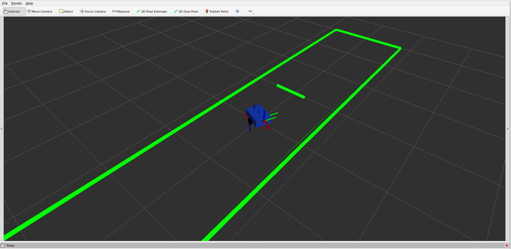

# `robot_motion_sim`

A ROS 2 C++ package for simulating a planar differential-drive robot with odometry, TF, wheel joint states, a Xacro robot model, and a simple ray-cast 2D LiDAR sensor.

The simulator subscribes to velocity commands on `/cmd_vel`, updates the robot state in a timer-based loop, and publishes odometry, transforms, joint states, laser scans, and world visualization markers.

---

## Features

- Differential-drive robot motion simulation
- `/cmd_vel` velocity command input
- `/odom` odometry publishing
- Dynamic TF publishing:

```text
odom -> base_link
```

- Xacro robot model loaded by `robot_state_publisher`
- Wheel joint state publishing on `/joint_states`
- Simulated 2D LiDAR on `/scan`
- Simple 2D ray-casting against line-segment worlds
- Independent LiDAR scan rate
- Optional Gaussian noise on LiDAR ranges
- Multiple selectable worlds:
  - `simple_room`
  - `corridor`
- RViz world visualization using `MarkerArray` on `/world_map`
- YAML-based parameter configuration
- Launch support with optional RViz startup

---
## RViz Visualization

### Simulator Overview

Robot model and TF frames:


### MarkerArray World

The world walls are published on `/world_map` as a
`visualization_msgs/msg/MarkerArray` message:



---
## Package Structure

```text
robot_motion_sim/
├── CMakeLists.txt
├── package.xml
├── README.md
├── config/
│   └── sim_params.yaml
├── docs/
│   └── marker_array.png
├── launch/
│   └── sim.launch.py
├── rviz/
│   └── sim.rviz
├── src/
│   └── robot_simulator_node.cpp
└── urdf/
    └── robot.urdf.xacro
```

---

## Build

From the root of your ROS 2 workspace:

```bash
colcon build --packages-select robot_motion_sim
source install/setup.bash
```

---

## Launch

Run the simulator with RViz:

```bash
ros2 launch robot_motion_sim sim.launch.py use_rviz:=true
```

Run without RViz:

```bash
ros2 launch robot_motion_sim sim.launch.py use_rviz:=false
```

Use a custom parameter file:

```bash
ros2 launch robot_motion_sim sim.launch.py \
  use_rviz:=true \
  params_file:=/path/to/custom_params.yaml
```

---

## Nodes

The launch file starts:

- `robot_simulator_node`
- `robot_state_publisher`
- `rviz2`, optionally

Check active nodes:

```bash
ros2 node list
```

Expected output:

```text
/robot_simulator_node
/robot_state_publisher
/rviz2
```

---

## Topics

### Subscribed Topics

| Topic | Type | Description |
|---|---|---|
| `/cmd_vel` | `geometry_msgs/msg/Twist` | Robot velocity command |

### Published Topics

| Topic | Type | Description |
|---|---|---|
| `/odom` | `nav_msgs/msg/Odometry` | Robot odometry |
| `/tf` | `tf2_msgs/msg/TFMessage` | Dynamic transforms |
| `/joint_states` | `sensor_msgs/msg/JointState` | Wheel joint states |
| `/scan` | `sensor_msgs/msg/LaserScan` | Simulated 2D LiDAR |
| `/world_map` | `visualization_msgs/msg/MarkerArray` | World wall visualization |

Depending on your ROS 2 version, `robot_state_publisher` may also publish:

```text
/robot_description
/tf_static
```

---

## TF Tree

The simulator publishes the moving transform:

```text
odom -> base_link
```

The robot model defines the remaining frames:

```text
base_link
├── left_wheel_link
├── right_wheel_link
├── caster_link
└── laser_link
```

Complete TF tree:

```text
odom
└── base_link
    ├── left_wheel_link
    ├── right_wheel_link
    ├── caster_link
    └── laser_link
```

Inspect TF:

```bash
ros2 run tf2_ros tf2_echo odom base_link
ros2 run tf2_ros tf2_echo base_link laser_link
```

---

## Configuration

Parameters are stored in:

```text
config/sim_params.yaml
```

Example:

```yaml
robot_simulator_node:
  ros__parameters:
    update_rate_hz: 20.0
    command_timeout: 0.5

    odom_frame_id: "odom"
    base_frame_id: "base_link"

    wheel_radius: 0.05
    wheel_base: 0.28

    left_wheel_joint_name: "left_wheel_joint"
    right_wheel_joint_name: "right_wheel_joint"

    scan_rate_hz: 10.0
    scan_angle_min: -1.5708
    scan_angle_max: 1.5708
    scan_angle_increment: 0.0174533
    scan_range_min: 0.05
    scan_range_max: 5.0
    scan_frame_id: "laser_link"

    laser_x_offset: 0.18
    laser_y_offset: 0.0
    laser_yaw_offset: 0.0

    scan_noise_enabled: false
    scan_noise_stddev: 0.01

    world_name: "simple_room"
```

Check loaded parameters:

```bash
ros2 param list /robot_simulator_node
```

Example:

```bash
ros2 param get /robot_simulator_node scan_rate_hz
ros2 param get /robot_simulator_node world_name
```

---

## Main Parameters

### Simulation Parameters

| Parameter | Description | Example |
|---|---|---|
| `update_rate_hz` | Main simulation update rate | `20.0` |
| `command_timeout` | Stop robot if command is stale | `0.5` |
| `odom_frame_id` | Odometry frame | `"odom"` |
| `base_frame_id` | Robot base frame | `"base_link"` |

### Robot Parameters

| Parameter | Description | Example |
|---|---|---|
| `wheel_radius` | Wheel radius in meters | `0.05` |
| `wheel_base` | Distance between left and right wheels | `0.28` |
| `left_wheel_joint_name` | Left wheel joint name | `"left_wheel_joint"` |
| `right_wheel_joint_name` | Right wheel joint name | `"right_wheel_joint"` |

### LiDAR Parameters

| Parameter | Description | Example |
|---|---|---|
| `scan_rate_hz` | Laser scan publishing rate | `10.0` |
| `scan_angle_min` | Minimum scan angle in radians | `-1.5708` |
| `scan_angle_max` | Maximum scan angle in radians | `1.5708` |
| `scan_angle_increment` | Angular resolution in radians | `0.0174533` |
| `scan_range_min` | Minimum valid range | `0.05` |
| `scan_range_max` | Maximum valid range | `5.0` |
| `scan_frame_id` | Laser frame ID | `"laser_link"` |
| `laser_x_offset` | Laser x offset from `base_link` | `0.18` |
| `laser_y_offset` | Laser y offset from `base_link` | `0.0` |
| `laser_yaw_offset` | Laser yaw offset from `base_link` | `0.0` |
| `scan_noise_enabled` | Enable Gaussian range noise | `false` |
| `scan_noise_stddev` | Noise standard deviation | `0.01` |

### World Parameters

| Parameter | Description | Values |
|---|---|---|
| `world_name` | Selects the simulated world | `simple_room`, `corridor` |

---

## Simulated LiDAR

The simulator publishes a 2D laser scan on:

```text
/scan
```

Type:

```text
sensor_msgs/msg/LaserScan
```

Default frame:

```text
laser_link
```

The scan is generated using simple 2D ray-casting. Each laser beam is intersected with line segments that represent the world walls and obstacles.

The LiDAR pipeline is:

```text
robot pose
  ↓
laser pose
  ↓
beam generation
  ↓
ray/segment intersection
  ↓
nearest valid hit
  ↓
optional Gaussian noise
  ↓
LaserScan message
```

Check the scan:

```bash
ros2 topic echo /scan --once
```

Check scan rate:

```bash
ros2 topic hz /scan
```

---

## World Visualization

The world geometry is published on:

```text
/world_map
```

Type:

```text
visualization_msgs/msg/MarkerArray
```

RViz can display these markers as line segments representing walls and obstacles.

Recommended RViz setup:

- Fixed Frame: `odom`
- Add `TF`
- Add `RobotModel`
- Add `Odometry`
- Add `LaserScan`
  - Topic: `/scan`
- Add `MarkerArray`
  - Topic: `/world_map`

---

## Robot Model

The robot model is defined in:

```text
urdf/robot.urdf.xacro
```

It includes:

- `base_link`
- `left_wheel_link`
- `right_wheel_link`
- `caster_link`
- `laser_link`

The model is loaded by `robot_state_publisher`.

The simulator publishes wheel states for:

```text
left_wheel_joint
right_wheel_joint
```

Make sure the joint names in `sim_params.yaml` match the joint names in the Xacro file.

---

## Differential Drive Kinematics

The simulator uses the standard differential-drive model.

Given:

```text
v = linear velocity
w = angular velocity
L = wheel_base
r = wheel_radius
```

Wheel linear velocities:

```text
v_left  = v - wL/2
v_right = v + wL/2
```

Wheel angular velocities:

```text
w_left_wheel  = v_left / r
w_right_wheel = v_right / r
```

Wheel positions are integrated over time and published through `/joint_states`.

---

## Testing

Start the simulator:

```bash
ros2 launch robot_motion_sim sim.launch.py use_rviz:=true
```

In another terminal:

```bash
source install/setup.bash
```

Send a forward command:

```bash
ros2 topic pub --rate 10 /cmd_vel geometry_msgs/msg/Twist \
"{linear: {x: 0.3}, angular: {z: 0.0}}"
```

Rotate in place:

```bash
ros2 topic pub --rate 10 /cmd_vel geometry_msgs/msg/Twist \
"{linear: {x: 0.0}, angular: {z: 0.8}}"
```

Move along a curve:

```bash
ros2 topic pub --rate 10 /cmd_vel geometry_msgs/msg/Twist \
"{linear: {x: 0.3}, angular: {z: 0.5}}"
```

Check odometry:

```bash
ros2 topic echo /odom
```

Check joint states:

```bash
ros2 topic echo /joint_states
```

Check LiDAR:

```bash
ros2 topic echo /scan --once
ros2 topic hz /scan
```

Check world markers:

```bash
ros2 topic echo /world_map --once
```

---

## World Selection

Use `world_name` in `sim_params.yaml`.

For the default room:

```yaml
world_name: "simple_room"
```

For the corridor:

```yaml
world_name: "corridor"
```

Then rebuild or relaunch the package:

```bash
ros2 launch robot_motion_sim sim.launch.py use_rviz:=true
```

---

## Enable LiDAR Noise

To enable Gaussian range noise:

```yaml
scan_noise_enabled: true
scan_noise_stddev: 0.01
```

Expected behavior:

- Valid scan ranges fluctuate slightly
- Overall wall and obstacle structure remains visible

---

## Validation

The simulator validates important parameters at startup, including:

- `update_rate_hz`
- `wheel_radius`
- `wheel_base`
- `scan_rate_hz`
- `scan_angle_min`
- `scan_angle_max`
- `scan_angle_increment`
- `scan_range_min`
- `scan_range_max`

Invalid values are replaced with safe defaults and warnings are printed.

---

## Troubleshooting

### Robot model does not appear in RViz

Check:

```bash
ros2 param get /robot_state_publisher robot_description
ros2 run tf2_ros tf2_echo odom base_link
```

Also verify:

- RViz Fixed Frame is `odom`
- `RobotModel` display is added
- `robot_state_publisher` is running
- URDF/Xacro file is installed correctly

---

### Robot model appears but does not move

Check dynamic TF:

```bash
ros2 run tf2_ros tf2_echo odom base_link
```

Send a velocity command:

```bash
ros2 topic pub --rate 10 /cmd_vel geometry_msgs/msg/Twist \
"{linear: {x: 0.3}, angular: {z: 0.0}}"
```

---

### Wheels do not rotate

Check joint states:

```bash
ros2 topic echo /joint_states
```

Verify that YAML joint names match the Xacro joint names:

```yaml
left_wheel_joint_name: "left_wheel_joint"
right_wheel_joint_name: "right_wheel_joint"
```

---

### LiDAR does not appear

Check:

```bash
ros2 topic info /scan
ros2 topic echo /scan --once
ros2 run tf2_ros tf2_echo odom laser_link
```

In RViz:

- Add `LaserScan`
- Set topic to `/scan`
- Set Fixed Frame to `odom`

---

### World markers do not appear

Check:

```bash
ros2 topic info /world_map
ros2 topic echo /world_map --once
```

In RViz:

- Add `MarkerArray`
- Set topic to `/world_map`
- Set Fixed Frame to `odom`

---

### Custom parameter file is not applied

Make sure the YAML node name is correct:

```yaml
robot_simulator_node:
  ros__parameters:
    scan_rate_hz: 10.0
    world_name: "simple_room"
```

Launch with:

```bash
ros2 launch robot_motion_sim sim.launch.py \
  use_rviz:=true \
  params_file:=/path/to/custom_params.yaml
```

---

## Dependencies

Main ROS 2 dependencies:

- `rclcpp`
- `geometry_msgs`
- `nav_msgs`
- `sensor_msgs`
- `visualization_msgs`
- `tf2`
- `tf2_ros`
- `tf2_msgs`
- `robot_state_publisher`
- `xacro`
- `rviz2`
- `launch`
- `launch_ros`

---

## Notes

- The simulator is 2D only.
- Only `linear.x` and `angular.z` from `/cmd_vel` are used.
- LiDAR ray-casting is based on simple line-segment intersection.
- The scan frame is `laser_link`.
- The world marker frame is `odom`.
- Wheel geometry should remain consistent between the YAML config and the Xacro model.

---
